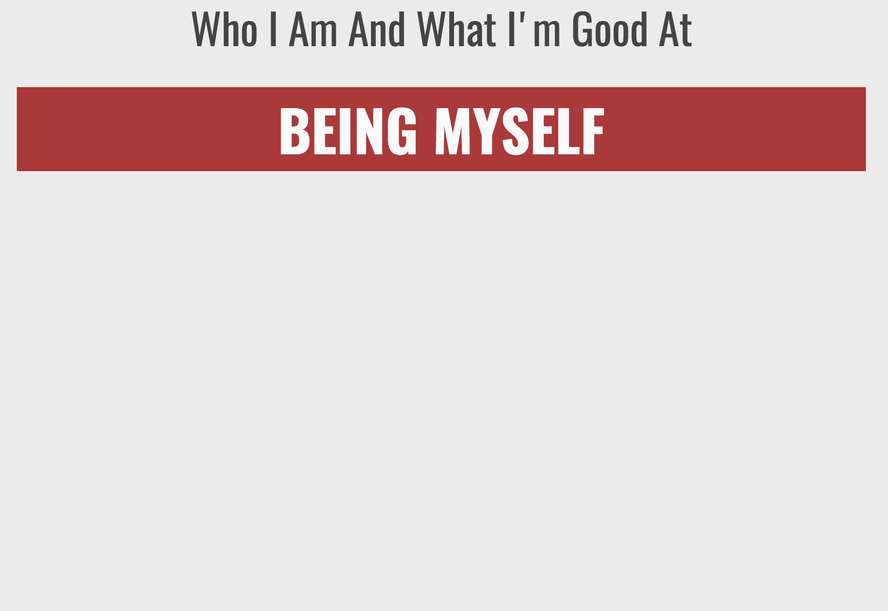
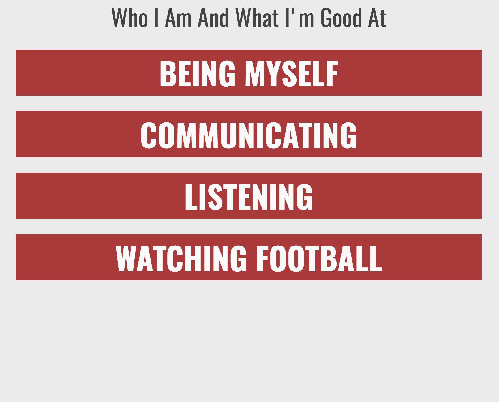

# Built-in Methods To Iterate Through An Array: Let's Get Real: From Array To A Webpage
<sup> Activity 3/3  </sup>
<!-- # ITERATING THROUGH AN ARRAY PART THREE:  -->

## Learn
So far we have used JavaScript in isolation and we have only seen the output in the console. By pairing JavaScript with other programming languages, HTML and CSS, we are able to create, and style web pages like the ones you see in your browser.

So far what we have done with the outputs from our programs is write them to the console using `console.log`. Now it's time to get real! Instead of just logging your skills to the console you are going to append them to elements on a web page!  We have set up the neccessary CSS and HTML files, and all you have to do is add the Javascript.

<!-- maybe website setup goes here? -->


<sup>Note: If you find yourself feeling confused by the addittion of HTML and CSS to this activity, you may want to complete Codeacademy  [Javascript and the DOM] (https://www.codecademy.com/courses/learn-javascript/lessons/javascript-dom/exercises/javascript-with-html-css?action=lesson_resume) Lesson By jonsamp as an introduction.</sup>

## Instructions

As humans sometimes we are hard on ourselves. We focus on what has hurt us, and what we are insecure about, while we don't spend the same emotional energy contemplating and articulating what we are good at, and what makes us the wonderful people we are in the world. Programming langauges, like JavaScript can help amplify our voice in articulating who we are and reduce the barriers to sharing that with the world.

#### 1. Create an array with a list of at least three things you are good at, or skills you have. Then `console.log`   your array to confirm that everything is working.

If you need some help getting started, based on the fact that you are reading this, you are *at least *one of these things:

- curious
- a self starter
- innovative
- interested
- technical
- pushing yourself
- motivated
- an algebraic thinker
- an engaged learner
- creative
- brave
- a boundary pusher
- a self teacher
- a teacher of others


### Hint
Did you create a variable named `whatImGoodAt`, and put at least 3 items inside of it? Did you wrap each of the items in qutation marks? `"I am a string and I belong in quotation marks so the computer knows I am a string!" `

``` javascript
var whatImGoodAt = ["communicating", "listening", "watching football" ]
console.log(whatImGoodAt)
```

***
#### 2. Write a line of code that uses the `forEach()` method to log each item in your array.


### Hint
Did you use a `console.log` for the skill parameter, inside of the `forEach()` method ?
``` javascript
whatImGoodAt.forEach(function(skill) {
console.log(skill);
});
```


***

<!-- I think 3 is actually the learn section and then start from the begginning to gt back to running the function -->
#### 3.  Now about that HTML and CSS! We have started you with all the code you need for a website, and we have added a title for you. Next to the editor you can see what the website looks like to begin.


Here is what the HTML code that makes this website look like:

``` html
<body>

<div class = "title">
Who I Am And What I'm Good At
</div>

<script src="sketch.js"></script>
</body>
```

In this case:
1. We create a div with a class of `title`. We will use this class in our CSS code to style the text inside of it.
2. We link to the file that holds the JavaScript you are writing and connects it to the body of your HTML page.


Here is the CSS code that we are using to style the website:

``` css
body{
background-color: rgba(68, 68, 68, .1);
font-family: 'Oswald';
color:rgba(68, 68, 68, 1);
font-size: 3.1vw;
width: 99%;
margin:auto;
}

.title{
text-align: center;
font-size: 150%;
}

h1{
background-color: rgba(170, 57, 57,1) ;
color: #FAFAFA;
margin: .5em;
text-transform: uppercase;
text-align: center;
}
```

In this case:

1. We set some basic styling options for the body of the website.
2. We set some basic styling options for the title element in our html.
3. We set the style for the elements which we will create with JavaScript, which will be header elements with the tag `<h1> </h1>`

In the code editor there is a JavaScript function that will turn anything it receives into an `h1` element and append it to the body of our website.

``` javascript
function addElement (skill) {
// create a new h1 header element
var newDiv = document.createElement("h1");
// create a text node from the parameter passed to the function
var newContent = document.createTextNode(skill);
//add the text node to the newly created  h1 element
newDiv.appendChild(newContent); 
//add the entire thing to the body of your webpage
document.body.appendChild(newDiv)
}

```


 All you need to know for now is that this function that will receive elements (say from an array of things you are good at?), and put them on to your webpage.   

In JavaScript you call a function with its name and any parameters inside parenthesis. It looks like this:

``` javascript
functionName(parameter)
```

#### Call the `addElement` function and pass it a text string as a paremter. The text string should be one addittional thing that you are good at (you can refer back to the list from step 1 if you want).

### Hint

Did you call the function `addElement` and pass it a text string as a parameter?

`addElement('Being myself')`



***
#### 4.Now all you need to figure out is how to get each of the items in your `whatImGoodAt` array to this `addElement` function. If only there was a built-in JavaScript method for iterating over an array of items and doing something for each one of them.....

Write a line of code that will send each item in your `whatImGoodAt` array to the `addElement` function.

### Hint

Did you use the `forEach()` method on the `whatImGoodAt` array? Did you call the `addElement` function inside of it, and pass the `skill` parameter to the function?
```
whatImGoodAt.forEach(function(skill) {
addElement(skill)

});
```




## To Review


